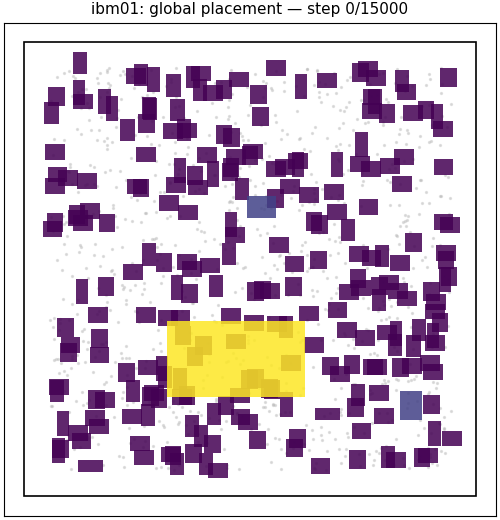
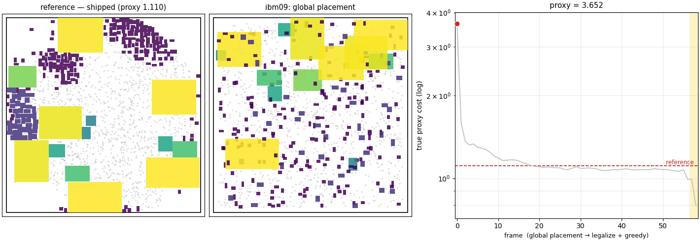
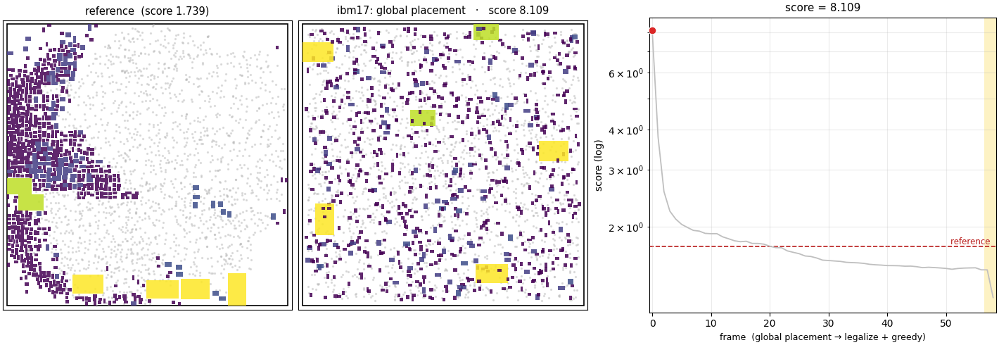
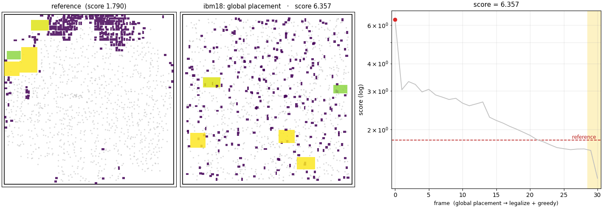

# GPU-era Macro Placement — Solver & Analysis

**Macro placement** is an early step in chip physical design: positioning the large fixed blocks — memories and IP cores — on the die before the millions of small standard cells are placed around them. Because those blocks dominate wirelength, routability, and congestion, where they go is one of the highest-leverage and hardest steps to automate.

This is a solver for the [Partcl/HRT Macro Placement Challenge](https://github.com/partcleda/macro-place-challenge-2026) — which ranks placers on 17 IBM/ICCAD04 benchmarks by a single cost (wirelength + density + congestion) with zero macro overlap — plus the experiments and findings that shaped it. A **differentiable global placer** (any smooth loss) produces a good layout from a random start, a legalizer removes all overlap, and **greedy detailed placement** polishes against the exact metric. Built on a from-scratch evaluator that is **exact to the reference metric but ~50–3600× faster**, which turns the search into something you can actually iterate on.

**Result: from random starting placements, average score 1.0137 across all 17 IBM benchmarks (zero overlaps) — 31% below the reference placement each benchmark provides (a RePlAce-quality baseline; RePlAce itself scores 1.458).** Full write-up with plots: [`notes/solution.html`](notes/solution.html).

---

## The problem in one minute

Place large fixed blocks ("macros") on a chip canvas to minimize a **score**, with **zero overlaps** and under **1 hour per benchmark**:

```
score = 1.0 · wirelength + 0.5 · density + 0.5 · congestion   (lower is better)
```

- **wirelength** — total half-perimeter of all nets (wires want connected macros close → clustering)
- **density** — mean of the top-10% most crowded grid cells (wants spreading)
- **congestion** — mean of the top-5% most routing-congested cells (wants routing breathing room)

The three objectives fight each other, the search space is ~10^800, and there are two macro types:
- **hard macros** — fixed-size rectangles you position (strict zero overlap);
- **soft macros** — standard-cell clusters, movable and allowed to overlap (a density/congestion stand-in).

Scoring is over 17 IBM benchmarks. Baselines (same metric): **RePlAce 1.4578**, **SA 2.1251** (17-benchmark averages).

---

## Formulation

**The scored metric.** Wirelength is half-perimeter (HPWL) summed over nets; density and congestion are top-fraction means over an *m×n* grid:

```
WL_true = (1/Z) · Σ_e  w_e [ (max_{i∈e} x_i − min_{i∈e} x_i) + (max_{i∈e} y_i − min_{i∈e} y_i) ]
```

Congestion deposits, per net, one unit of routing demand along an **L-route skeleton** — a horizontal segment on the *source row* and a vertical segment on the *sink column* — into capacity-normalized H/V grids, box-blurs them, and reports `abu₅` = mean of the top 5% of cells. Density is the analogous `abu₁₀` over cell occupancy `ρ_b`. Both top-*k* means and the L-route routing are non-differentiable in the macro coordinates.

**The smooth surrogate (global stage).** `max`/`min` are replaced by log-sum-exp,

```
max_i x_i ≈  γ · log Σ_i e^{ x_i/γ},   min_i x_i ≈ −γ · log Σ_i e^{−x_i/γ}      (exact as γ→0)
```

density by a differentiable **overflow** penalty `Σ_b max(0, ρ_b − ρ*)²` over soft cell-assignments, and the objective follows a **back-loaded homotopy**: with normalized time `t∈[0,1]` and effective progress `τ(t)=t^p` (`p≈3.8`), `γ` and the term weights anneal from smooth/weak to sharp/strong on `τ` — start spread and forgiving, tighten late. Adam optimizes the free macro centers; `place_multistart` keeps the best of *N* random seeds. The loss is pluggable — any differentiable objective drops into the same engine (this is what let me test the congestion surrogates in the appendix).

---

## Architecture

Two ideas: **make evaluation cheap so you can search hard**, and **combine a differentiable global stage with an exact-metric detailed stage.**

```
                     ┌─ differentiable global placer (GPU, any smooth loss) ─┐
   random inits ──►  │  log-sum-exp WL + overflow density, back-loaded ramp   │
   (best of N)       └───────────────────────────────────────────────────────┘
                                          │
                     legalize (strict zero overlap)
                                          │
                     greedy detailed placement ──► score
                          ▲
        incremental evaluator (exact, ~1 ms/move), all 17 benchmarks in parallel

   hyperparameters tuned once by Bayesian search (TPE) on 3 designs;
   winner picked under best-of-16 multi-start; applied unchanged to all 17.
```

### 1. `fast_eval.py` — a validated, fast reimplementation of the metric
The official evaluator is pure-Python and takes ~1 s per evaluation. I reimplemented it in vectorized NumPy and **validated each term against the ground truth**:

| term | accuracy vs official | speed |
|------|---------------------|-------|
| wirelength | 6×10⁻¹⁰ rel. err | 0.16 ms (was 570 ms) |
| density | 3.7×10⁻⁸ rel. err | exact |
| congestion | ~10⁻⁵ in the search regime | 37 ms (was 430 ms) |

### 2. Incremental single-move evaluation — the engine
Local search changes **one macro at a time**, so I keep the per-net wirelength, the density grid, and the routing arrays as live state and update only what a move touches. Result: **0.96 ms/move vs 52 ms full recompute (55×), exact to 2×10⁻¹⁶**, with correct undo. Also supports **orientation flips** (Klein-4) incrementally. This is what makes deep search (10⁵–10⁶ moves) feasible in seconds.

### 3. `legalizer.py` — guaranteed zero overlap
Three stages: vectorized push-apart → strict-gated Gauss-Seidel cleanup (never worsens) → relocate-to-empty finisher. **All 17 benchmarks reach strict zero overlap.**

### 4. `analytical.py` — the differentiable global placer (GPU)
Macro centers are free coordinates optimized by Adam against a **smooth surrogate** of the score: per-net **log-sum-exp** wirelength and an **overflow density** penalty (plus optional soft-top-k RUDY congestion and an electrostatic-FFT density mode). A **back-loaded homotopy schedule** — start spread and weakly constrained, ramp the weights up sharply late — avoids the local minima a fully-on objective falls into. The loss is pluggable, so the same engine optimizes any differentiable objective. `place_multistart` keeps the best of N random inits.

### 5. `local_search.py` — exact-metric detailed placement
Greedy hill-climbing over single-macro moves, accepting only true-score improvements. Warm-started from the global placement, it closes the gap between the smooth surrogate (plus legalization) and the real metric. Co-optimizes **soft macros** (the key lever) and preserves hard-macro legality. Also includes SA, orientation flips, congruent swaps, and an operator-portfolio variant.

### 6. Tuning & validation pipeline
- `bayes_search.py` — first-round Bayesian (TPE) search over the loss weights and schedule on 3 representative designs (single-seed), minimizing mean ratio-to-reference; a `--finalize` stage re-scores the top configs under **best-of-16 multi-start** to pick the winner above the seed-noise floor.
- `bayes_swap.py` — second-round, warm-started search that tunes on the **deployment metric** (best-of-3 seeds *after* a short greedy polish) and adds the overlap-window / swap / diffusion mechanisms to the space; its winner is the final tuned config.
- `validate_all.py` — applies the frozen winner to **all 17** benchmarks (held-out generalization check).
- `greedy_polish.py` + `final_report.py` — detailed-placement polish and the three-way comparison (global / global+greedy / greedy-from-reference), reporting the per-benchmark best.
- `parallel_run.py` — 16× throughput: all 17 as independent checkpointed chains across a worker pool.

### Also explored
- `moves.py` — hard-macro swap and rigid cluster moves.
- `force.py` — a continuous density force field and a RUDY congestion surrogate.
- `bayes_window.py` — earlier single-seed search over the overlap-window alone (superseded by `bayes_swap.py`); `variance_diag.py`, `attribution_swap.py` — the paired variance/attribution diagnostics behind finding 6.

---

## Results

Differentiable global placement → legalize → greedy polish, applied to all 17 IBM benchmarks (per-benchmark best over the pipeline's methods):

| metric | value |
|--------|-------|
| **average score (abs, over 17)** | **1.0137** |
| vs reference (1.4772) | **−31%** (mean per-benchmark ratio 0.690) |
| vs RePlAce (1.4578) | **−30%** |
| vs SA (2.1251) | **−52%** |
| vs leaderboard #1 (0.9507) | +6.6% |
| overlaps | 0 (all 17) |
| best single benchmark (ibm09) | **0.771** |

Every benchmark beats the reference; on the easiest designs (ibm09 0.77, ibm01 0.79) I dip below the current leaderboard leader's *average* (0.9507). The tuned config transfers to the 14 held-out designs with only a mild overfit (held-out mean ratio 0.923 vs 0.885 on the 3 tuning designs). Greedy from the reference alone averages **1.083**; the differentiable global stage supplies a **6.2%** better basin on top of that. The score comes from a best-of-*N*-after-greedy **pool** of configs run side by side: the final tuned config — which holds the deep-overlap penalty off early so wirelength can re-sort macro ordering, with annealed same-size macro swaps — wins **11 of 17** designs, and the earlier search's window-free configs win the other 6. Different configs win different designs, so keeping the per-design best beats any single one.

**Compute.** A single candidate is ~3–6 min (measured: GPU global stage ~80 s, CPU greedy polish ~1–5 min) — inside the challenge's 1-hour-per-benchmark limit. The 1.0137 figure is best-of-*N* (~45 candidates/benchmark within the 1-hour budget, greedy-polished in parallel across 16 cores while the GPU produces the next candidate). A single median candidate averages ~1.1; best-of-*N* saturates fast, and this run already sits near that floor.

### The optimization in motion

Each animation replays that benchmark's actual winning run (its winning config + seed) as a three-panel strip: the **reference** placement (left), my **differentiable global stage** animating random-spread → clustered → legalized → greedy-polished (middle), and the **true score per frame** on a log axis with the reference score as a dashed line (right) — the curve dives below it. Hard macros are rectangles (color = area); soft cell-clusters are light dots. Spanning the design space: **ibm01** (small), **ibm09** (medium), **ibm17** (large, congestion-bound), **ibm18** (large) — each run's score is shown live in the right panel.






---

## Key findings (the interesting part)

These shaped the approach and are worth as much as the score:

1. **The score is soft-macro-dominated.** ~98% of my gain comes from co-optimizing soft macros; moving hard macros changes the score by only ~0.2%. Great for Tier-1 ranking, but a caveat for the real objective (at Tier-2, only hard-macro positions survive).
2. **Congestion is the wall.** At my best point it's 57% of the remaining cost and the term local search reduces least — because it depends on discrete *routing*, not a smooth function of positions.
3. **Congestion is best optimized implicitly, not as an explicit loss term.** The metric is non-differentiable, so I built two congestion surrogates — a RUDY penalty and a faithful, non-gameable **L-route** surrogate that correlates 0.94–0.99 with the true metric (appendix). *Neither improves the final score when added to the global loss.* Across four schedules — persistent, late, congestion-first, and a low-congestion warm-start — the paired effect on the post-greedy score is neutral-to-negative. Greedy detailed placement already minimizes the *true* congestion directly, and an explicit global term mostly trades away wirelength for an arrangement greedy would have reached anyway. Congestion falls out of good wirelength + spreading + exact-metric polish; forcing it earlier hurts.
4. **A differentiable global stage + greedy detail beats either alone.** Greedy from the reference averages 1.083; the differentiable global placer supplies a better starting basin, and global+greedy reaches **1.0137** (a ~6% better basin than greedy-from-reference). The global stage optimizes a *surrogate* and is then legalized, so greedy — working on the *exact* metric — does most of the absolute-quality cleanup on top of the global output.
5. **Multi-start matters more than tuning precision.** Single-seed scores carry ~2% noise, larger than the gap between good configs, so single-seed rankings are unreliable — the search's apparent-best config was a lucky seed. Re-scoring the top configs at best-of-16 reshuffled the order (a config ranked 5th won) and lowered the score ~6%. The final pick is always made under multi-seed evaluation.
6. **Per-run reordering can't beat best-of-N.** The global stage spreads macros but rarely reorders them past each other, so I tried four fixes — an early overlap-tolerance window, discrete jumps, injected noise, annealed same-size swaps — each with its own Bayesian search on the deployment metric. Every one improves the *typical* placement but not best-of-*N*, and a paired variance test shows why: they make runs *converge* (lower mean, up to ~10× lower spread), but best-of-*N* wants the *best* of many, and the random-start spread already produces one at least as good — tightening the distribution just thins the tail best-of-*N* picks from. The random-start variance isn't noise to remove; it's the search. (The window+swap variant stays in the pool only as a *high-variance* config that wins some designs at large *N*.)
7. **The tuned config generalizes (with a mild overfit).** Bayesian search on 3 designs, applied unchanged to the other 14, transfers well — held-out mean ratio 0.923 vs 0.885 on the tuning designs, a small ~4-point penalty. 16 of 17 still beat the reference under the frozen global config.

---

## How to run it

The full pipeline: tune once, finalize the winner under multi-start, validate on all 17, then greedy-polish.

```bash
# 1. Bayesian search for the loss weights/schedule (3 designs): first round single-seed,
#    second round on the deployment metric (best-of-3 after greedy); finalize at best-of-16
uv run python scripts/bayes_search.py && uv run python scripts/bayes_search.py --finalize
uv run python scripts/bayes_swap.py                   # warm-started deployment-metric round

# 2. Apply the frozen winner to all 17 (held-out validation)
uv run python scripts/validate_all.py --seeds 8

# 3. Best-of-N deployment for the final score: a pool of the tuned configs plus the
#    overlap-window/swap variant (notes/best100_pool.json); within the 1-hour/benchmark
#    budget it cycles configs × seeds, greedy-polishes each (parallel on CPU while the GPU
#    produces the next), and keeps the per-benchmark best.
uv run python scripts/deploy_best100.py   # -> notes/best100_report.json (per-benchmark best + which config won)
```
(Requires the challenge repo's `macro_place` package + benchmarks; scripts use its venv.)

---

## What would push toward the top of the leaderboard

I sit ~7% above the leaders (~0.95 avg), and the gap concentrates on the hard, congestion-bound designs (ibm08/17). Two intuitive levers I can now **rule out** (appendix): a better congestion term in the global loss, and a congestion-directed detailed placer — both are neutral-to-negative in paired tests, because the score is soft-cell-dominated and greedy already owns congestion.

What remains is structural. Single-cell greedy at zero temperature plateaus against congestion because relieving a hot region requires moving *groups* of cells coherently, not one point at a time — any single move that vacates a congested cell lengthens its own nets and is rejected. The lever is therefore a detailed placer that makes **coordinated, multi-cell moves** (or runs under a temperature that accepts transient wirelength increases), so it can restructure the global arrangement rather than locally polish it. That — not more hyperparameter tuning or more congestion modeling — is where the remaining gap lives.

---

## Appendix: what I tried that isn't in the final pipeline

The negative results constrain the design as much as the positive ones. Each was evaluated with **paired** experiments (identical seeds across arms, differencing per seed) to cancel the ~2–6% seed noise that otherwise swamps these effects.

**Congestion surrogates in the global loss.**
- *RUDY.* Routing demand modeled as a net's bounding-box footprint spread over its cells. Differentiable and cheap, but **gameable**: deposited demand scales as `1/bbox-area`, so the optimizer lowers the surrogate by *spreading* nets while the true L-route congestion rises. It diverges from the metric (correlation ≈ 0); abandoned.
- *L-route surrogate.* A faithful, non-gameable differentiable version of the true metric: a partition-of-unity soft row/column assignment (`softrow`) and a sigmoid-product segment occupancy (`softseg`) deposit demand on the L-route skeleton; the top-5% mean is a bisection **soft-top-k**. It correlates **0.94–0.99** with the true congestion. Added to the global loss under four schedules — **persistent**, **late** (ramped on `τ`), **congestion-first** (congestion at `t=0`, WL/density ramped in afterward), and as a **low-congestion warm-start** (a congestion+spread pre-phase before the standard schedule). Paired isolation tests on the hard designs came back **neutral-to-negative** on the post-greedy score every time (e.g. the low-congestion warm-start: +0.09 score, 0/4 seeds — the warm-started descent lands in a *worse* basin). Mechanism: greedy optimizes true congestion directly, so the global term adds no capability it lacks while corrupting the wirelength basin it starts from. A "scatter" (anti-clustered) warm-start leaned slightly positive but sat inside the n=4 noise band.

**Congestion-directed detailed placement.** A move operator that sends hot-cell macros toward cold grid cells sampled from the live congestion field — the discrete analogue of a congestion gradient — with acceptance still on the exact score. Paired against baseline greedy it was **negative**: teleport-to-cold moves lengthen the moved cell's own nets and get rejected, so they waste the fixed move budget; zero-temperature single-cell descent cannot express the coordinated moves congestion relief actually needs (this is what motivates the "coordinated moves" conclusion above).

**Concurrent / interleaved global+detailed.** Alternating chunks of Adam steps and greedy moves — every confound-controlled variant, including SA-style acceptance and matched compute — never beats the phase-separated global-then-greedy pipeline. The two stages are genuinely separated: the global stage sets the coarse arrangement, greedy does the exact-metric detail.

**Macro-reordering mechanisms in the global stage.** The differentiable stage spreads macros continuously but rarely lets two cross past each other, so the random start largely fixes their ordering. Four attempts to break that lock, each with its own Bayesian search on best-of-*N*-after-greedy and tested paired against the plain stage: an **overlap-tolerance window** (hold the deep-overlap penalty off early so macros stack and slide through, then ramp it on — single candidate ~5% better, best-of-*N* unchanged); **jumps** (teleport high-wirelength macros to net centroids early — helps wirelength-bound designs, hurts congestion-bound, net neutral); **diffusion** (annealed Langevin noise — global, and a variant gated to overlapping macros only — mobility ∝ 1/√area so big macros stay put; crossing-scale is a wash, larger just scatters); **annealed same-size swaps** (a simulated-annealing pass over swaps of equal-footprint macros — density is invariant, so acceptance is on wirelength only — reaching multi-swap orderings single-move greedy can't, still no best-of-*N* gain). Each search tuned on the **deployment metric** — best-of-3 seeds after a short greedy, not single-seed — so configs are scored the way they're used. All four mechanisms reduce the run-to-run variance best-of-*N* exploits; the window+swap variant is the one kept — it became the final tuned config, winning its 11 designs as a high-variance pool member at large *N* (finding 6).

**Other.** SA and SA/greedy hybrids (greedy-until-*N*-accepts) — no gain over pure greedy at matched compute. Electrostatic-FFT density mode — equivalent to the overflow penalty, not better. Multi-start initialization variants (density-only, low-congestion, scatter) — see the warm-start row above.
